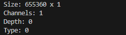
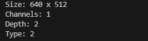

##  Y16 Camera Capture: OpenCV vs ioctl (V4L2)

This project demonstrates the difference between using **OpenCV's high-level camera API** and **low-level `ioctl` calls (V4L2)** for capturing 16-bit grayscale (`Y16`) frames from a USB camera (based on the Cypress FX3 chip).

While OpenCV provides convenient abstractions, it fails to correctly handle certain formats — in this case, silently misinterpreting `Y16` frames. This repository shows how to fix that using direct `ioctl` calls in C.

---

###  Why This Matters

* High-level APIs like OpenCV's `VideoCapture` are fast to use — but they may not correctly support **non-standard or high-bit-depth image formats**.
* `Y16` (16-bit grayscale) is commonly used in **depth sensing, thermal imaging, and industrial cameras** — and mishandling this format results in corrupted image data.
* Direct control with `ioctl` and V4L2 provides **reliable and accurate access**, at the cost of more complexity.

---

##  What's Inside

### `opencv.cpp`

Capture using OpenCV (`cv::VideoCapture`). Demonstrates:

* Incorrect handling of `Y16`
* OpenCV misinterpreting the data

### `ioctl.c`

Capture using V4L2 `ioctl` in C. Demonstrates:

* Correct format negotiation
* Use of `mmap` buffers
* Access to raw `Y16` frames

### `outputs/`

Outputs from both methods for comparison.

---

##  Requirements

* Linux with V4L2 support (`/dev/video0`)
* A camera that supports `Y16` format (e.g. Cypress FX3-based)
* OpenCV (for the C++ part)
* GCC

---

##  Run the Examples

### 1. Build both programs:

```bash
g++ opencv.cpp -o MAIN.out -I/your_path_to_opencv/include/opencv4 -L/your_path_to_opencv/lib -lopencv_core -lopencv_imgcodecs -lopencv_highgui -lopencv_imgproc -lopencv_videoio -lopencv_features2d -lopencv_calib3d
g++ ioctl.c -o MAIN.out -I/your_path_to_opencv/include/opencv4 -L/your_path_to_opencv/lib -lopencv_core -lopencv_imgcodecs -lopencv_highgui -lopencv_imgproc -lopencv_videoio -lopencv_features2d -lopencv_calib3d
```

### 2. Run OpenCV capture:

```bash
./MAIN.out
```

### 3. Run ioctl (V4L2) capture:

```bash
sudo ./MAIN.out
```

---

## 📈 Results

| Method       | Output Format               | Reliability                      | Notes |
| ------------ | --------------------------- | -------------------------------- | ----- |
| OpenCV       |  | ❌ Incorrect shape, no errors     |       |
| V4L2 + ioctl |    | ✅ Fully correct low-level access |       |

---

## 📚 References

* [V4L2 API Documentation (Linux Kernel)](https://www.kernel.org/doc/html/latest/userspace-api/media/v4l/v4l2.html)
* [OpenCV VideoCapture Docs](https://docs.opencv.org/4.x/d8/dfe/classcv_1_1VideoCapture.html)
* Cypress FX3 USB controller: [EZ-USB FX3](https://www.infineon.com/cms/en/product/universal-serial-bus/usb-peripheral-controllers/usb-30-peripheral-controllers/cypress-ez-usb-fx3/)

---


